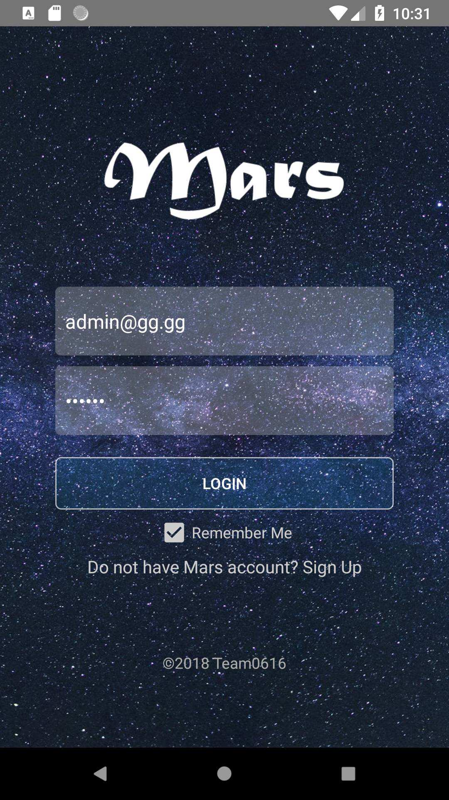

As a deliverable of the second-year software design course, I developed an open-source Android Game Platform that contains three games in a group of five members.

## Methods

The game center was developed on Android Studio using the Java programming language. In terms of the design, there are two classes important for the individual games. The first class is the board manager, which controls the behaviour of the boards. The second class is the movement controller that controls the behaviour of the grid views. The movement controller composites a board manager so that it supervises the manager according to the user’s interaction, such as tapping and swiping, to the grid views. 

The game center has three core fragments, which are the profile fragment, the scoreboard fragment, and the games fragment respectively. The profile and scoreboard fragments store and display user information corresponding to data on the Firebase database.

The main design pattern used in the game center implementation is the Model-View-Controller pattern, where the model classes contain the data, view classes present the data and controller classes modify the data. With this design, the testing was convenient as only the controller (logic) classes need to be tested. 

## Results

The platform contains registration, login, and scoreboard features, which allow the players to form communities, play new games, and compete in a ranking system. The sample games provided on the platform include Sudoku, 2048, and Sliding Tiles. The figures below show the game center preview. 

```{r ssa-logo, fig.align = 'center', out.height = "60%", fig.cap = "Login Page", echo=FALSE}

```

```{r ssa-logo1, fig.show='hold', fig.align = 'center', out.width = "60%", fig.cap = "Game Screenshots", echo=FALSE}
knitr::include_graphics(c("overview.png", "sudoku.png"))
```

## Growth 

Through this project, I learned and practiced object-oriented programming using Java. In addition, the Mars platform was my first large project in a team environment. The time our team spent working together at Bahen center was one of the best memories of my undergraduate. I learned from this experience that teamwork is much more than five individuals working in parallel like threads. Creative solutions often come from team interactions.
