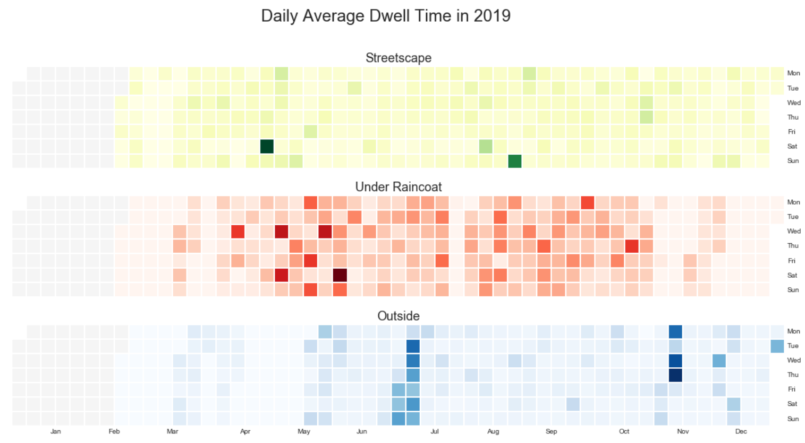
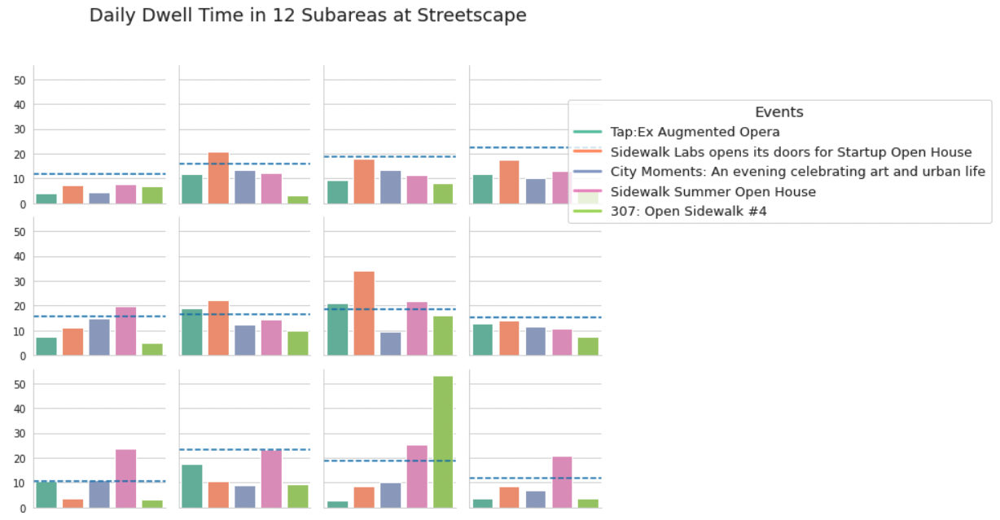
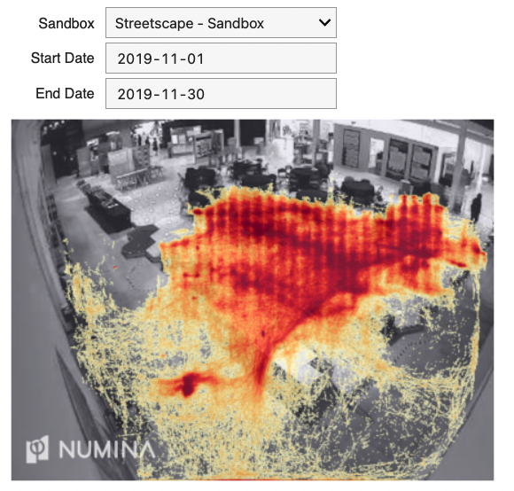
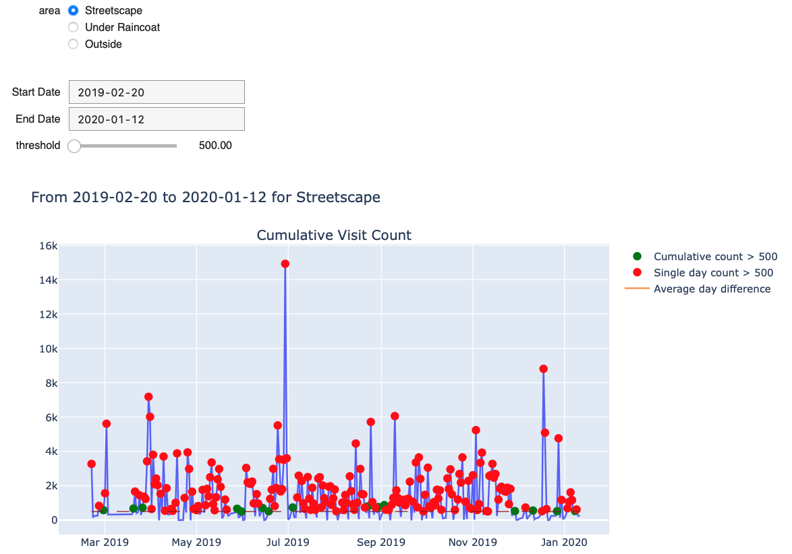

During the data science course, I performed data analysis with two other team members to investigate how people explored and used space in Sidewalk Labs regarding the dwell time and desire lines. By analyzing how different factors affected the pattern, recommendations were made to help with urban space design decisions.

## Methods

The analysis was carried out using Python on Jupyter Notebook. The results are presented in visualization such as charts and heatmap plots with interactive widgets. We also created a dashboard using Voila, which turns Jupyter notebooks into standalone web applications. The dashboard enabled us to better communicate the results to the audience.

To answer the question of how people are making using the space in Sidewalk Lab and where they tend to linger, we divided each space evenly into 12 square blocks with 3 rows and 4 columns so that each block occupies approximately the same area. The behavior zones were generated using createBehaviorZone from the Numina API. For each of the streetscape, under the raincoat, and outside areas, we queried the data for the average dwell time in each of the 12 subareas using zoneDwellTimeDistribution during the period when the Sidewalk Lab is open to the public from February 20, 2019, to January 12, 2020. Then, we displayed the overall average dwell time on the heatmap, where darker blue in a square indicates a longer dwell time in that block. Radio buttons were used to select an area among the three to see the corresponding heatmap of dwell times. The users could use the dropdown menu to pick one of the events to view how events affect dwell times and the position where people linger. 

Then, we analyzed the desire lines, which are the travelling lines of the visitors, to learn where people tend to pass through. Heatmap drawn in the webpage utilized the data feedHeatmps in the GraphQL database. A scatter plot was drawn by the value and its x, y coordinate generated by the feedHeatmaps query. The scatter plot located the point by its coordinate, reflecting the value using the deepness of a predefined colour scheme. The image of the sandbox was selected by the input of the user and scaled to the right ratio to accurately display the plots. A calendar that summarizes the population of a site by day was generated along with the heatmap. On the calendar figure, the deepness of the colour reflects the average value among all coordinates. The average value was calculated once per day in the given time span.

## Results

The calendar heatmap gave us an overall idea of the daily dwell time pattern although it could not be used to compare the dwell time among the three areas. In May, people spent a long time under the raincoat largely because of the rainy season. On the other hand, people lingered outside in June and July, when the weather was nice in summer. 

```{r ssa-logo, fig.align = 'center', out.width = "100%", fig.cap = "Calendar heatmap of dwell time", echo=FALSE}

```

```{r ssa-logo1, fig.align = 'center', out.width = "100%", fig.cap = "Dwell time at events in 12 subareas", echo=FALSE}

```

In terms of the travelling lines of the visitors, we could tell from the figure that there had been tables in the middle area under the raincoat. On some occasions, people did not tend to pass through two circular areas in the middle of the streetscape.
 
```{r ssa-logo2, fig.align = 'center', out.width = "100%", fig.cap = "Desire lines at streetscape", echo=FALSE}

```
 
Recommendations were made for when maintenance operations could be possible scheduled based on our observations. In general, the three areas should be maintained separately on different weekdays if possible. The best time for maintenance during the daytime would be in the morning. The streetscape should be maintained mostly frequently with an average of once every two days. In addition, we recommended the operators maintain the place before and after each event.

```{r ssa-logo3, fig.align = 'center', out.width = "100%", fig.cap = "Site visit counts", echo=FALSE}

```

## Growth

Through this project, I had the opportunity to gain firsthand experience of a data scientist's workflow, including the cleaning, wrangling, analysis, and visualization of data. In addition, I practiced using API to remotely obtain data used on the webpage without loading the data to any local machine, which could impose a security threat. I gained the understanding that it is important to be careful and serious about the privacy philosophy.
